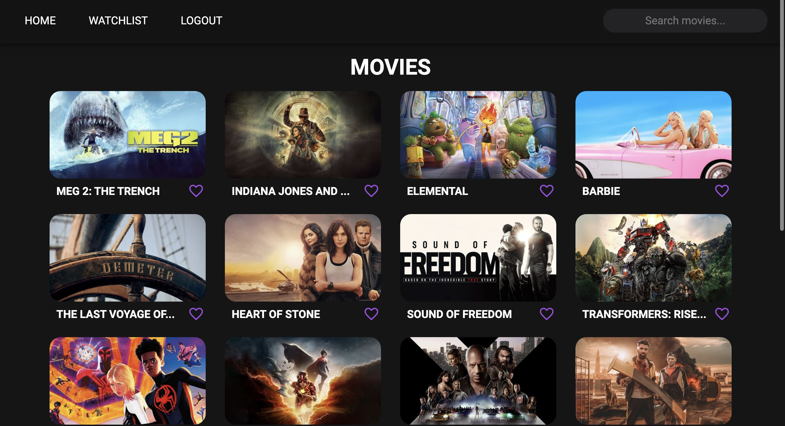
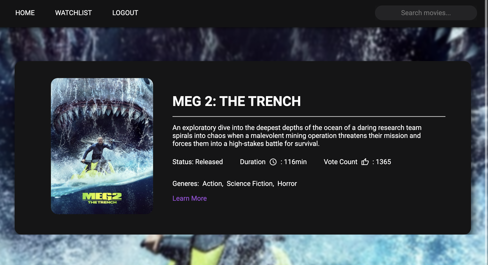

<H1 align ="left" > MOVIEDB  </h1>
<h5  align ="left"> 
Movie application powered by the The Moviedb API. Created using MongoDB, Express, React, NodeJS. 
<h5>
<br/>

## Setup

Run this project locally by forking the repository then cloning. (You must have two terminals, one for the server and another for the client).

- Open the project in your VSCode.

In the first terminal [SERVER]

```
$ cd server
$ npm install (install server-side dependencies)
$ npm start
```

In the second terminal [CLIENT]

```
# --- Terminal ---

$ cd client
$ npm install (install client-side dependencies)
$ npm start 
```

##  Key Features

- Pagination.
- Marking/ unmarking as favorite.
- Searching.
- User login & registration linked to MongoDB.
- Authentication using JWT Tokens.

### Technologies

- [MongoDB]()

- [ExpressJS]()

- [ReactJS]()

- [NodeJS]()

- TMDb API --> https://www.themoviedb.org/

<br/>

 ##  Screenshots 
 

---- -

--- - 

## Author
- [Jericho Mata's Porfolio](https://jerichomata.com/)
- [Jericho Mata's LinkedIn](https://www.linkedin.com/in/jerichomata/)

## License

MIT License
